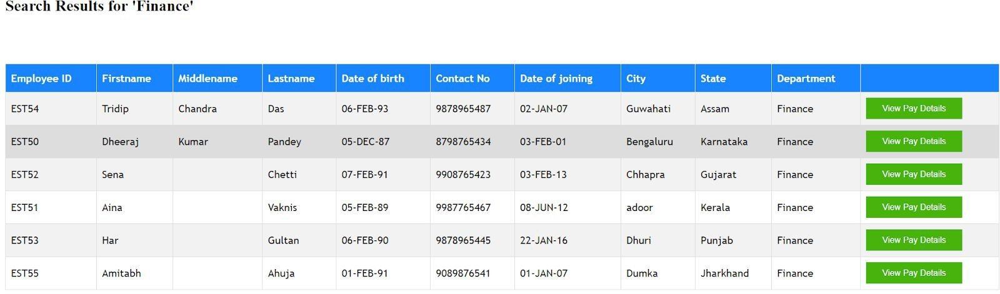

# Payroll-Management-System
Using OracleSQL, this is a payroll management system that keeps track of all the transactions and details of the employees of an organisation.

To run this,

### You'll need to make the connection configurations in 'my_connect_str.php' first and then start the project through the 'index.php' file.

## ER Diagram

## Screengrabs

  

  

  

  
